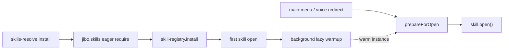

# Architecture

How **Be** loads and runs skills in this repository.

## Overview

**Be** (`@be/be`) is the host application. At startup it installs a skills-root
resolver, constructs only **eager** skills from `jibo.skills`, then
[`skill-registry`](../@be/be/skill-registry.js) wraps redirect/voice paths so
**lazy** skills from `jibo.lazySkills` load on demand. After the first skill
opens, the registry also warms remaining lazy packs in the background so later
opens reuse a warm instance (re-`require` only when `index.js` mtime changes).



## Skill identity

- Skill IDs look like npm package names, e.g. `@be/bad-apple`, `@be/recipe`.
- Each skill is an **asset-pack**: a folder with `index.html`, bundled `index.js`, assets, and a `launch.rule` for voice.

## On-disk layout (important for SSM)

System manager scans **`/opt/jibo/Jibo/Skills/@be`** for launchable skills. Only the Be host should live there:

```text
Skills/                         (repo root on robot)
  @be/
    be/                         # ONLY launchable host SSM should list
      skills/                   # packs ship inside Be (OTA of @be/be)
        idle/
        main-menu/
        jukebox/
        be-framework/           # library, not launchable
        …
      package.json              # jibo.skillsRoot: "./skills"
      …
  jibo-tbd/
  …
```

Do **not** put skill packs as *direct* siblings of `be` under `@be/` (e.g. `@be/idle`) — SSM will list them as separate skills. Put them under `@be/be/skills/<name>/` instead.

## Skills-root resolution

Before Be loads, [`@be/be/index.html`](../@be/be/index.html) calls `require('./skills-resolve').install()`.

That hooks Node’s `Module._resolveFilename` so `require('@be/<name>')` and `PathUtils.resolve` / `resolveAssetPack` map to `<skillsRoot>/<name>/`.

`jibo.skillsRoot` in `@be/be/package.json` is `"./skills"` (repo `@be/be/skills/` from `@be/be`). Absolute paths are allowed for odd layouts.

It also puts `@be/be/node_modules` on `NODE_PATH` so skill packs can still `require('jibo')` and other host runtime deps.

Third-party packages (`jibo`, pixi, …) still resolve from `@be/be/node_modules/`.

## Registration (required)

Skills are registered in **`@be/be/package.json`** under two lists:

| List | When loaded | Reload |
|------|-------------|--------|
| `jibo.skills` | At Be boot (eager) | Be restart |
| `jibo.lazySkills` | On first open, or via background warmup after first skill opens | When `index.js` mtime changes (leave → reopen) |

Eager set is reserved for boot/background correctness: idle, first-contact,
restore, surprises, settings, and clock (alarm `postInit`).

Example:

```json
"jibo": {
  "skillsRoot": "./skills",
  "skills": [
    "@be/idle",
    "@be/first-contact",
    "@be/restore",
    "@be/surprises",
    "@be/settings",
    "@be/clock"
  ],
  "lazySkills": [
    "@be/jukebox",
    "@be/bad-apple"
  ]
}
```

Skills are **not** listed in Be’s npm `dependencies`. Drop a folder at
`@be/be/skills/<name>/` with a valid `package.json`, add the id to `lazySkills`
(or `skills` if it must run `postInit` at boot), and restart Be once so the
registry sees the new id.

If a skill is missing from both lists, the menu may redirect to it but
`prepareForOpen` will warn and the open will fail. If the skills-root folder is
missing or unreadable, `require('@be/...')` fails at load time (logged).

## Boot sequence

1. `skills-resolve.install()` (from `index.html`).
2. `beacon.start()`.
3. `new Be()` — constructs only `jibo.skills` (eager). Be’s implementation lives
   under [`@be/be/lib/`](../@be/be/lib/) (`Be.js`, `SkillSwitchScheduler.js`, …);
   [`index.js`](../@be/be/index.js) is a thin re-export so parallel edits do not
   collide in one file.
4. `skill-registry.install(be)` — wraps `skillRedirect` / voice switch; after
   the first skill opens, starts sequential background warmup of
   `jibo.lazySkills` (EoS packs first, then main-menu, then the rest).
5. `be.init()` — jibo init, postInit for eager skills, launch first skill.

Load failures are logged. Common causes:

- Missing or unreadable `index.js` (forgot to build).
- **`chmod`** — Be checks that `package.json` and `index.js` are readable; use `chmod -R a+rX` on deployed skill folders.

## Lazy reload workflow

1. Edit and rebuild a lazy skill’s `index.js` (TypeScript skills must be rebuilt).
2. Leave the skill (back to idle / menu) — the instance stays warm; asset caches
   are cleared on close, but the skill object remains in `be.skills`.
3. Open it again — if `index.js` mtime changed, `prepareForOpen` unloads,
   re-`require`s from disk, and builds a new instance; otherwise the warm
   instance is reused (voice / menu / `skillRedirect` alike).

Background warmup after first open may already have constructed the skill, so
the first user open after boot is often a warm reuse with no cold `require()`.

Same-skill **refresh** (without leaving) does **not** re-require. Core/eager
skill code changes still need a full Be restart.

## Entry point

Each skill’s `package.json` declares:

```json
"jibo": {
  "main": "index.html",
  "type": "asset-pack",
  "launchRule": "launch.rule",
  "display-name": "bad-apple"
}
```

`index.html` provides a 1280×720 `#face` div and loads the bundle:

```html
<div id="face"></div>
<script>
  const Skill = require('./index');
  const skill = new Skill();
</script>
```

The bundled `index.js` exports a class extending **`BeSkill`** from `@be/be-framework`.

## Lifecycle hooks

Skills in this repo typically implement:

| Hook | Purpose |
|------|---------|
| `postInit(done)` | Early setup; usually calls `done()` immediately |
| `preload(done)` | Install speech delegate if needed; preload assets |
| `open(result?)` | Skill becomes active — mount UI, start playback |
| `close(done)` | Tear down UI, remove listeners, call `done()` |
| `exit()` | Leave the skill (often triggered by swipe-down) |

Pattern used by Bad Apple, Jukebox, and Doom:

- **`open`**: subscribe swipe-down, defer heavy work with `setTimeout(..., 50)` so the first frame can paint.
- **`close`**: unsubscribe gestures, cleanup views, null references.

## Launch paths

Skills can be opened in two ways:

1. **Main menu** — button `destination` → `@be/<name>` via `redirectToSkill()` (see [main-menu.md](main-menu.md)).
2. **Voice** — `launch.rule` maps utterances to `{skill='\@be/<name>'}`.

Both paths go through `prepareForOpen` then `open()` on a (possibly freshly
constructed) skill instance.

## Face resolution

The display target is **1280×720**. Layout and video should assume this size (scale with CSS `object-fit: contain` or PIXI sprite dimensions as needed).

## Related docs

- [creating-a-skill.md](creating-a-skill.md) — step-by-step new skill
- [main-menu.md](main-menu.md) — menu integration
- [build-and-deploy.md](build-and-deploy.md) — build and robot deploy
