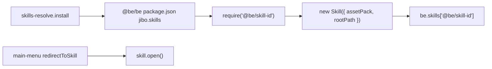

# Architecture

How **Be** loads and runs skills in this repository.

## Overview

**Be** (`@be/be`) is the host application. At startup it installs a skills-root resolver, reads its own `package.json`, iterates `jibo.skills`, and constructs each skill. The main menu and voice launch rules then redirect into those skills.



## Skill identity

- Skill IDs look like npm package names, e.g. `@be/bad-apple`, `@be/recipe`.
- Each skill is an **asset-pack**: a folder with `index.html`, bundled `index.js`, assets, and a `launch.rule` for voice.

## On-disk layout (important for SSM)

System manager scans **`/opt/jibo/Jibo/Skills/@be`** for launchable skills. Only the Be host should live there:

```text
Skills/                         (repo root on robot)
  @be/
    be/                         # ONLY launchable host SSM should list
    skills/                     # packs (not direct @be children as skills)
      idle/
      main-menu/
      jukebox/
      be-framework/             # library, not launchable
      …
  jibo-tbd/
  …
```

Do **not** put skill packs as *direct* siblings of `be` under `@be/` (e.g. `@be/idle`) — SSM will list them as separate skills. Put them under `@be/skills/<name>/` instead.

## Skills-root resolution

Before Be loads, [`@be/be/index.html`](../@be/be/index.html) calls `require('./skills-resolve').install()`.

That hooks Node’s `Module._resolveFilename` so `require('@be/<name>')` and `PathUtils.resolve` / `resolveAssetPack` map to `<skillsRoot>/<name>/`.

`jibo.skillsRoot` in `@be/be/package.json` is `"../skills"` (repo `@be/skills/` from `@be/be`). Absolute paths are allowed for odd layouts.

It also puts `@be/be/node_modules` on `NODE_PATH` so skill packs can still `require('jibo')` and other host runtime deps.

Third-party packages (`jibo`, pixi, …) still resolve from `@be/be/node_modules/`.

## Registration (required)

A skill must appear in **`jibo.skills`** in `@be/be/package.json`. Be loads these at startup via `require(id)`.

Example:

```json
"jibo": {
  "skillsRoot": "../skills",
  "skills": [
    "@be/bad-apple"
  ]
}
```

Skills are **not** listed in Be’s npm `dependencies`. Drop a folder at `@be/skills/<name>/` with a valid `package.json`, register the id, restart Be.

If a skill is missing from `jibo.skills`, the menu may redirect to it but Be will not have constructed it. If the skills-root folder is missing or unreadable, `require('@be/...')` fails at load time (logged).

## Boot sequence

1. `skills-resolve.install()` (from `index.html`).
2. Load Be; read `@be/be/package.json` via `jibo.utils.PathUtils.findRoot()`.
3. For each entry in `jibo.skills`:
   - `require(id)` — loads the skill’s bundled `index.js` from the skills root.
   - Instantiate `new Skill({ assetPack: id, rootPath: ... })`.
   - Validate it is a `BeSkill` and store in `be.skills[id]`.
4. Wire lifecycle, redirects, and default skills (`@be/idle`, etc.).

Load failures are logged. Common causes:

- Missing or unreadable `index.js` (forgot to build).
- **`chmod`** — Be checks that `package.json` and `index.js` are readable; use `chmod -R a+rX` on deployed skill folders.

## Entry point

Each skill’s `package.json` declares:

```json
"jibo": {
  "main": "index.html",
  "type": "asset-pack",
  "launchRule": "launch.rule",
  "display-name": "bad-apple"
}
```

`index.html` provides a 1280×720 `#face` div and loads the bundle:

```html
<div id="face"></div>
<script>
  const Skill = require('./index');
  const skill = new Skill();
</script>
```

The bundled `index.js` exports a class extending **`BeSkill`** from `@be/be-framework`.

## Lifecycle hooks

Skills in this repo typically implement:

| Hook | Purpose |
|------|---------|
| `postInit(done)` | Early setup; usually calls `done()` immediately |
| `preload(done)` | Install speech delegate if needed; preload assets |
| `open(result?)` | Skill becomes active — mount UI, start playback |
| `close(done)` | Tear down UI, remove listeners, call `done()` |
| `exit()` | Leave the skill (often triggered by swipe-down) |

Pattern used by Bad Apple, Jukebox, and Doom:

- **`open`**: subscribe swipe-down, defer heavy work with `setTimeout(..., 50)` so the first frame can paint.
- **`close`**: unsubscribe gestures, cleanup views, null references.

## Launch paths

Skills can be opened in two ways:

1. **Main menu** — button `destination` → `@be/<name>` via `redirectToSkill()` (see [main-menu.md](main-menu.md)).
2. **Voice** — `launch.rule` maps utterances to `{skill='\@be/<name>'}`.

Both paths end in the same `open()` on the registered skill instance.

## Face resolution

The display target is **1280×720**. Layout and video should assume this size (scale with CSS `object-fit: contain` or PIXI sprite dimensions as needed).

## Related docs

- [creating-a-skill.md](creating-a-skill.md) — step-by-step new skill
- [main-menu.md](main-menu.md) — menu integration
- [build-and-deploy.md](build-and-deploy.md) — build and robot deploy
