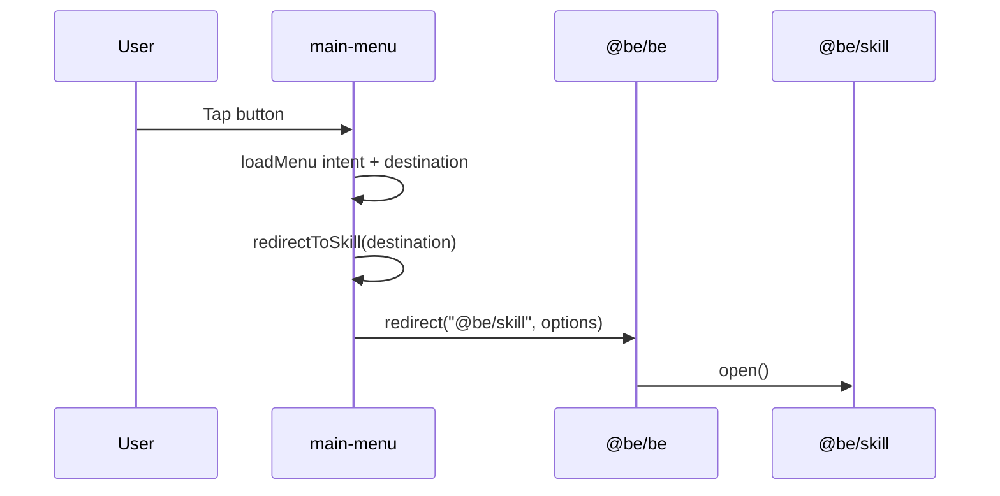

# Main menu integration

How a tap on the main menu launches a Be skill.

The main menu is just a large MenuView wired to `redirectToSkill()`. For MenuView JSON structure, button actions, and in-skill menus, see [patterns/menu-views.md](patterns/menu-views.md).

## Flow



## Menu button definition

Buttons live in JSON view configs under `@be/skills/main-menu/resources/views/`.

**Top-level menu:** `main-menu-verbal.json`

Each list item includes:

- **`id`** — component id (for NLU matching).
- **`label`** — displayed name.
- **`iconSrc`** — e.g. `resources/icons/bad-apple.png` (under `@be/skills/main-menu`).
- **`action`** — utterance fired on tap.

Example (Bad Apple):

```json
{
  "id": "bad-apple",
  "label": "Bad Apple",
  "colors": ["0x111111", "0xFFFFFF"],
  "iconSrc": "resources/icons/bad-apple.png",
  "action": {
    "type": "utterance",
    "data": {
      "utterance": {
        "intent": "loadMenu",
        "entities": {
          "destination": "bad-apple"
        }
      }
    }
  }
}
```

The **`destination`** string is the skill’s short name — **not** the full `@be/...` id.

## redirectToSkill()

Implemented in `@be/skills/main-menu/index.js`:

1. Receives `destination` (e.g. `"bad-apple"`, `"recipe"`, `"jukebox"`).
2. Maps special cases (cloud skills, photobooth → create, etc.).
3. For normal Be skills: `targetSkill = '@be/' + skill`.
4. Calls `jibo.face.views.changeView({ remove: true, leaveEmpty: true, ... })`.
5. Calls `this.redirect(targetSkill, redirectOptions)` with NLU `{ intent: 'menu', entities: { domain: skill } }`.

So `"destination": "bad-apple"` → **`@be/bad-apple`**.

The skill **must** be registered in `@be/be/package.json` `jibo.skills` or redirect succeeds but nothing loads.

## Submenus

Not every skill sits on the top-level grid.

- **Fun Stuff** — `fun-stuff-verbal.json`; parent button uses `"destination": "fun"` (opens submenu, does not redirect).
- **Personal Report** — `personal-report-verbal.json`; parent uses `"destination": "personal-report"`.

Submenu buttons use the same `loadMenu` + `destination` pattern with their own destination strings (`joke`, `dance`, `weather`, etc.). Some map to cloud skills in `redirectToSkill()`.

## Icons

Place PNGs in:

```
@be/skills/main-menu/resources/icons/<name>.png
```

Reference as `"iconSrc": "resources/icons/<name>.png"` in the verbal JSON.

After changing main-menu resources, rebuild/sync `@be/skills/main-menu` if your workflow bundles it (the verbal JSON is typically loaded at runtime).

## Voice launch (parallel path)

Menu taps are separate from **`launch.rule`** in each skill’s folder. Voice rules map phrases directly to `{skill='\@be/name'}`. You can launch a skill by voice without a menu button if the rule and registration are in place.

## Checklist for a new menu entry

1. Skill registered in `@be/be/package.json`.
2. Button added to appropriate verbal JSON with matching `destination`.
3. Icon added under `@be/skills/main-menu/resources/icons/`.
4. Deploy main-menu + Be package.json if needed.
5. Restart Be and tap the button.

## Historical note

Bad Apple replaced the old **Placeholder 2** slot (`ph2`), which previously pointed at Doom (`"destination": "doom"`). Doom is no longer on the main menu; see [examples/doom.md](examples/doom.md).
